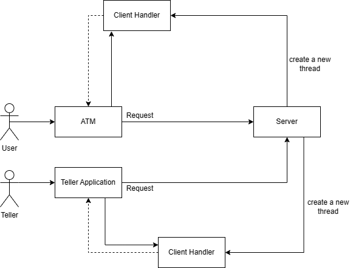
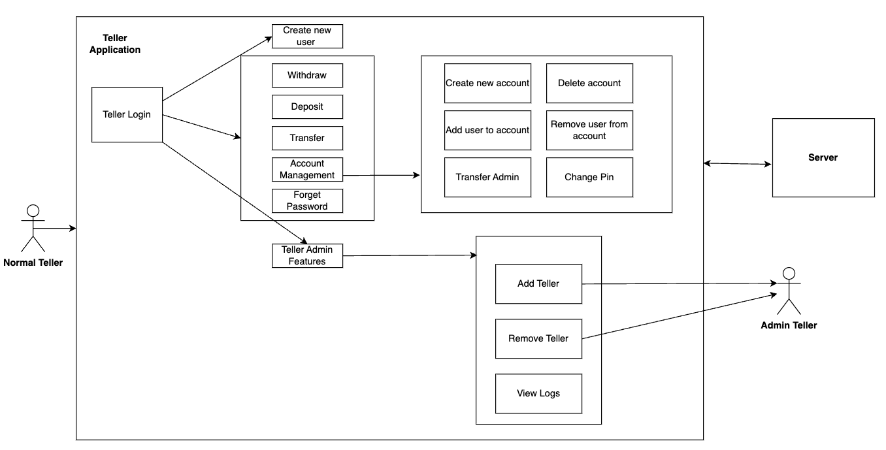
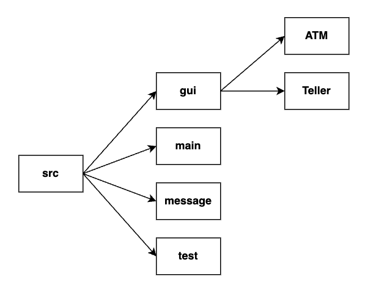

# Banking_System_Project
This is a folk of [Banking System](https://github.com/danny-zebby/Banking_System).

## What is this?
Our Banking system is a set of Java applications with GUIs that operate over TCP/IP. It allows users to talk to a teller to create, change, and delete checking and savings accounts. Along with this, there is an around the clock ATM service for basic deposits, withdraws, and transfers. 

## Overall Architecture

This Banking System consists of three main parts: ATM, Teller application, and the Server. Among them, ATM and Teller applications are the clients with GUI, which could be zero or multiple instances, making requests to the Server to establish the connections and make transactions over the Internet (TCP/IP). The Server is a multi-threaded application which takes every single connection request from the client and creates a new thread to handle it. 

For ATM, the main features are withdraw money, deposit money, and transfer money to another account.

For Teller Client, there are two different actors on the application: normal client (or client) and admin teller. The differences between these two teller are that admin teller can do all the things normal teller can plus three more features: add a new teller, remove a teller, and view logs. A normal teller can create a new Bank User and assist a Bank User to withdraw, deposit, transfer money plus change password, create new Bank Account, delete an account, add a user to this account, remove user from account, transfer account admin to another user, and change account pin.

The whole Banking System has the following structure. 

With this structure in mind, let's look at our overall file structure. All codes are placed under the "src" folder and there are four sub-folders: gui, main, message, and test. 

* The "gui" folder stores all the Java Swing code and it has two sub-folders: one for ATM, and the other for Teller.
* The "main" folder contains major classes like BankUser, BankAccount, Teller, Server, ATMClient, TellerClient. In particular, ATMClient and TellerClient are command-line interfaces that can work with the server; ATMGUIClient and TellerGUIClient are the controllers that empower the GUI class and work with the server; ATMMain and TellerMain are the starting points for ATM GUI application and TellerClient GUI application.
* The "message" folder contains all the Enums and Message class used for the communication between client (ATM application or Teller client application) and the server.
* The "test" folder contains all JUnit test codes (JUnit 5) all the project.

## Where to start?

1. Git clone the repository to your machine and open it with your favorite editor. In this project, we choose Eclipse and follow [this short tutorial](https://github.com/Donny-Guo/Eclipse-Github-Workflow?tab=readme-ov-file#2-download-existing-files-from-github) in case you are not familiar with how to use Github with Eclipse. Also make sure that you have Java installed on your machine (preferably Java 17+) and we use JUnit 5 for unit tests.
2. Go to src/main and start the Server.java
3. Under src/main, Run ATMMain.java and TellerMain.java

## Group Picture

Left to right: Dongping Guo, Breanne Loo, Daniel Z. Rodriguez, Sungmo Koo
